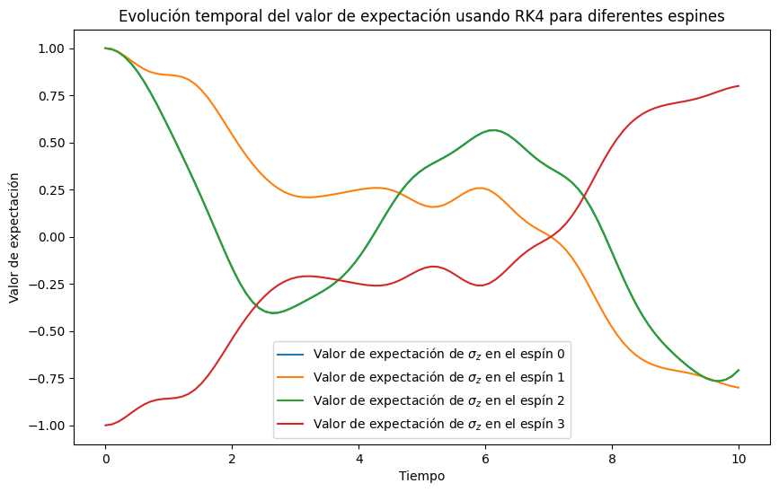
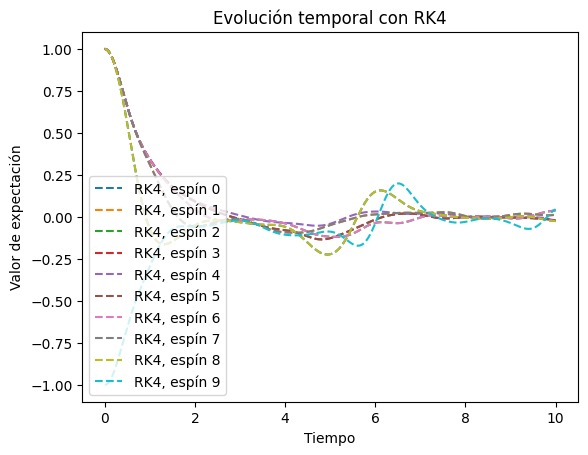
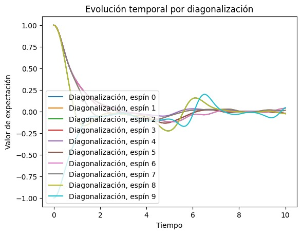
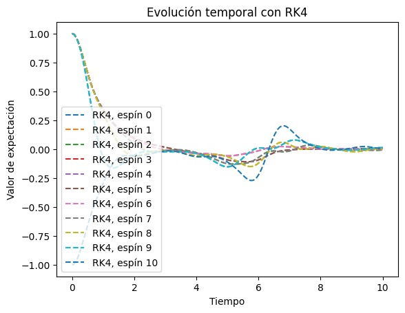
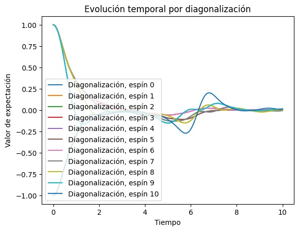

# Gráfica obtenida a partir de Python:

La gráfica obtenida representa cómo cambia en el tiempo el valor esperado del operador $\sigma_{z}$ para cada uno de los cuatro espines en una cadena, usando el modelo de Ising con un campo transversal. Se empleó el método de Runge-Kutta de cuarto orden (RK4) para calcular la evolución temporal del sistema.

# Gráfica obtenida a partir de Python Diagonalization:
En las siguientes gráficas, observaremos las diferencias entre el método RK4 y el método de diagonalización. Utilizaremos una grilla de 1001 puntos y el valor de N será inicialmente 10 y luego la aumentamos a 11.
Para las primeras dos gráficas, compararemos los resultados con N = 10. Veremos las gráficas obtenidas con ambos métodos: RK4 y diagonalización, y analizaremos los tiempos de evolución correspondientes.

Grafica con el metodo RK4 (N=10): Tiempo obtenido 62.48s 

Grafica para el metodos de Diagonalizacion (N=10): 

Tiempo obtenido 31.794s

###Ahora lo vemos con N = 11.

Grafica con el metodo RK4, tiempo obtenido 337.792s 

Grafica con el metodo de diagonalizacion, tiempo obtenido: 137.4689s

## Conclucion:

Podemos observar como el tiempo de evolucion en el caso del metodo RK4 siempre es mayor al obtenido por medio de diagonalizacion. 
